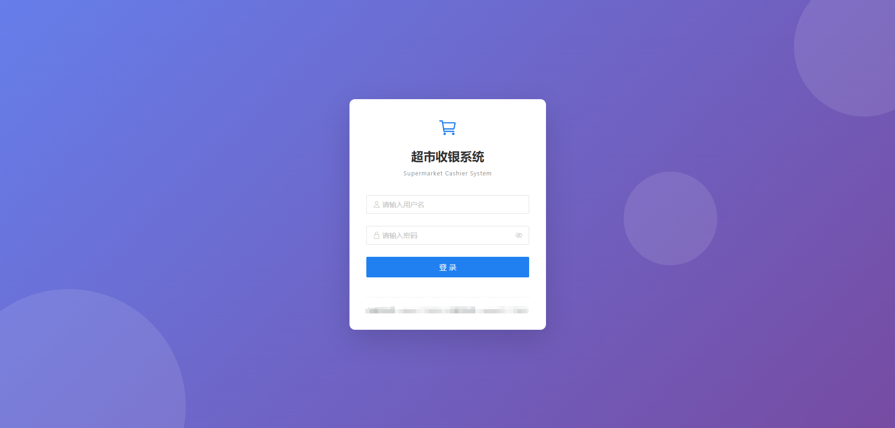
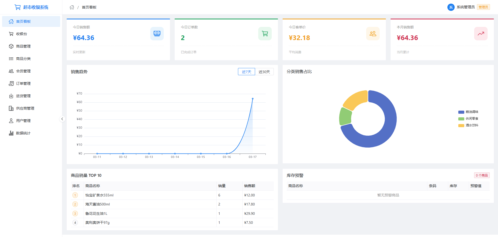
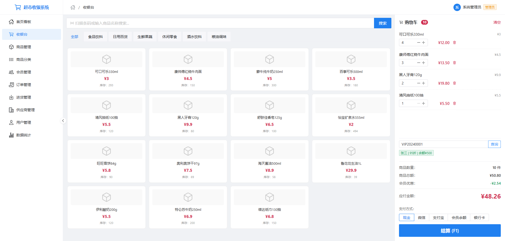
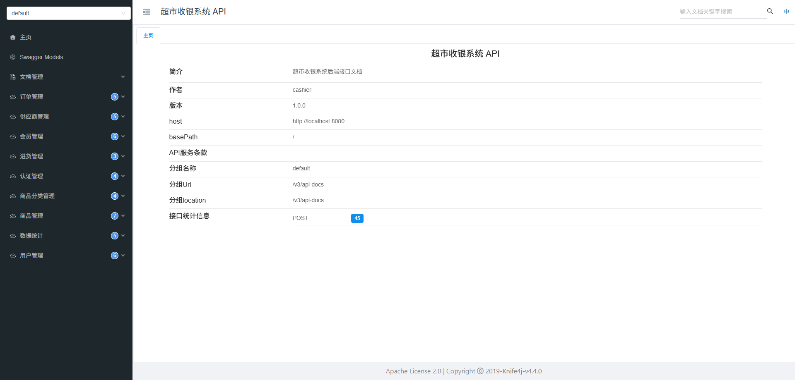

# 超市收银系统

一个基于 Spring Boot + Vue 3 的现代化超市收银管理系统，提供完整的商品管理、收银结算、会员管理、进货管理、统计分析等功能。

## 功能特性

- **收银台**：支持扫码录入、数量修改、会员结算、多种支付方式
- **商品管理**：商品信息维护、分类管理、库存预警
- **会员管理**：会员信息管理、余额充值、积分折扣
- **订单管理**：订单查询、订单详情、销售记录
- **进货管理**：进货记录、供应商管理
- **统计分析**：销售趋势、商品排行、收银员业绩
- **系统管理**：用户管理、权限控制

## 页面展示

### 登录页



### 首页看板



### 收银台



### 接口文档



## 技术栈

### 后端

| 技术 | 版本 | 说明 |
|------|------|------|
| Spring Boot | 3.2.4 | 基础框架 |
| MyBatis-Plus | 3.5.5 | ORM 框架 |
| Sa-Token | 1.37.0 | 权限认证 |
| MySQL | - | 数据库 |
| Druid | 1.2.21 | 数据库连接池 |
| Knife4j | 4.4.0 | 接口文档 |
| Hutool | 5.8.25 | 工具库 |

### 前端

| 技术 | 版本 | 说明 |
|------|------|------|
| Vue | 3.4.21 | 前端框架 |
| Vite | 5.2.0 | 构建工具 |
| Pinia | 2.1.7 | 状态管理 |
| Vue Router | 4.3.0 | 路由管理 |
| Naive UI | 2.38.1 | UI 组件库 |
| Axios | 1.6.8 | HTTP 请求 |
| ECharts | 5.5.0 | 图表库 |
| Day.js | 1.11.10 | 日期处理 |

## 项目结构

```
Supermarket-Cashier-System/
├── cashier-backend/                # 后端项目
│   ├── src/main/java/com/cashier/
│   │   ├── common/                 # 公共模块
│   │   │   ├── config/             # 配置类
│   │   │   ├── constant/           # 常量
│   │   │   ├── dto/                # 公共DTO
│   │   │   ├── exception/          # 异常处理
│   │   │   ├── result/             # 统一响应
│   │   │   └── utils/              # 工具类
│   │   └── module/                 # 业务模块
│   │       ├── auth/               # 认证模块
│   │       ├── goods/              # 商品模块
│   │       ├── member/             # 会员模块
│   │       ├── order/              # 订单模块
│   │       ├── purchase/           # 进货模块
│   │       ├── statistics/         # 统计模块
│   │       ├── supplier/           # 供应商模块
│   │       └── user/               # 用户模块
│   └── src/main/resources/
│       ├── db/                     # 数据库脚本
│       ├── mapper/                 # MyBatis映射文件
│       └── application.yml         # 配置文件
│
└── cashier-frontend/               # 前端项目
    ├── src/
    │   ├── api/                    # API 接口
    │   ├── assets/                 # 静态资源
    │   ├── components/             # 公共组件
    │   ├── layout/                 # 布局组件
    │   ├── router/                 # 路由配置
    │   ├── stores/                 # 状态管理
    │   ├── utils/                  # 工具函数
    │   └── views/                  # 页面组件
    └── vite.config.js              # Vite 配置
```

## 快速开始

### 环境要求

- JDK 17+
- Node.js 18+
- MySQL 8.0+
- Maven 3.6+

### 后端启动

1. 创建数据库并导入初始数据

```bash
mysql -u root -p < cashier-backend/src/main/resources/db/init.sql
```

已有库增量（幂等，可重复执行）：`cashier-backend/src/main/resources/db/incremental/run_all_incremental.sql`。仅打包该 SQL + 离线执行 bat：`powershell -NoProfile -File scripts/pack-db-incremental.ps1`，输出 `dist/supermarket-cashier-db-incremental.zip`。

2. 修改数据库配置

编辑 `cashier-backend/src/main/resources/application-dev.yml`，修改数据库连接信息：

```yaml
spring:
  datasource:
    url: jdbc:mysql://localhost:3306/cashier_db?useUnicode=true&characterEncoding=utf-8&serverTimezone=Asia/Shanghai
    username: root
    password: root
```

（若本机 MySQL 不同，可用环境变量 `DB_PASSWORD` 或复制 `application-local.yml.example` 为 `application-local.yml` 覆盖。）

3. 启动后端服务

```bash
cd cashier-backend
mvn spring-boot:run
```

后端服务启动后访问：
- 接口地址：http://localhost:8080
- 接口文档：http://localhost:8080/doc.html

### 前端启动

1. 安装依赖

```bash
cd cashier-frontend
npm install
```

2. 启动前端（需先有 `dist/` 构建产物）

```bash
npm run dev
```

当前脚本为 **Vite preview**：默认 **http://localhost:5173**，并把 **`/api` 代理到 http://localhost:8080**，请先启动后端。仅有 `dist`、无完整 Vue 源码时也可这样预览。

3. 若有完整源码，构建生产版本

```bash
npm run build
```

## 默认账号

| 角色 | 用户名 | 密码 |
|------|--------|------|
| 管理员 | admin | 123456 |
| 收银员 | cashier01 | 123456 |
| 收银员 | cashier02 | 123456 |

## 数据库设计

系统包含以下主要数据表：

| 表名 | 说明 |
|------|------|
| sys_user | 系统用户表 |
| goods_category | 商品分类表 |
| goods | 商品表 |
| member | 会员表 |
| sale_order | 销售订单表 |
| sale_order_item | 订单明细表 |
| supplier | 供应商表 |
| purchase_record | 进货记录表 |

## API 文档

启动后端服务后，访问 Knife4j 接口文档：http://localhost:8080/doc.html

## 订单备注、上传与区域（后端）

- **上传**：`POST /api/file/upload`（`multipart/form-data`，字段名 `file`），返回体 `data.url` 为形如 `/uploads/yyyyMM/uuid.jpg` 的路径；浏览器 `` 已放行鉴权（仅读文件，生产环境请评估风险）。
- **结算**：`POST /api/order/settle` 请求体为 `memberCardNo`、`payType`、`items`、`remark`；收货地址与省市区编码写入 `remark` 分段（与收银台前端一致）。
- **省市区**：`GET`/`POST /api/region/all` 返回整树；`GET`/`POST /api/region/children?parentId=` 支持懒加载（`parentId` 为空为省级根）。
- **Vue 接入示例**（省市区与备注拼接）：见 [`cashier-frontend/integration/README.md`](cashier-frontend/integration/README.md)。

## 说明

前端完整工程若不在本仓库，可将 `cashier-frontend/integration` 下示例合并到你的 Vue 项目。

## 许可证

MIT License
